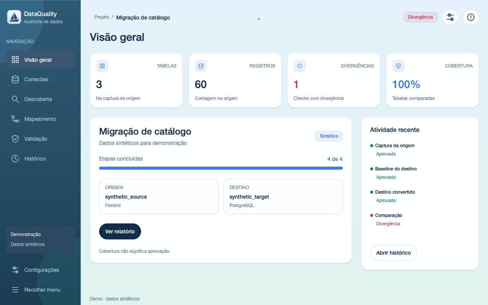

# DataQuality

Ferramenta Python 3.11/MIT para auditar migrações localmente, sem depender de IA.
Pacote e executável: `dataqualy`. Preserva CSV, regras PySpark e pacotes/anexos;
adiciona auditoria de banco inteiro com snapshots, mapeamento e evidências redigidas.

## Download do aplicativo

- [macOS Apple Silicon — DMG](https://github.com/hugaojanuario/dataquality/releases/latest/download/DataQuality-macOS-arm64.dmg)
- [Windows 64-bit — ZIP](https://github.com/hugaojanuario/dataquality/releases/latest/download/DataQuality-Windows-x64.zip)
- [Windows 64-bit — EXE direto](https://github.com/hugaojanuario/dataquality/releases/latest/download/DataQuality-Windows-x64.exe)

Todos os arquivos e checksums ficam na
[release mais recente](https://github.com/hugaojanuario/dataquality/releases/latest).
Java 17 e o driver JDBC do banco continuam necessários para conexões reais.

## Quick start — exemplo totalmente sintético

```sh
python3.11 -m venv .venv
source .venv/bin/activate
python -m pip install -e ".[dev,jdbc]"
dataqualy audit demo --project reports/synthetic-demo
```

Abra `reports/synthetic-demo/report.html`. O exemplo executa origem → baseline
vazia → destino convertido → comparação → relatório, com conectores em memória,
sem Java, banco, conversor ou IA. Use outro diretório para repetir uma execução.

## Banco inteiro — Firebird → PostgreSQL

Edite `configs/audit-firebird.yml` e `configs/audit-postgresql.yml` com conexões de
teste. Use usuários com SELECT e acesso a todos os metadados do escopo. Defina
`DATAQUALY_SOURCE_PASSWORD` e `DATAQUALY_TARGET_PASSWORD` no ambiente; nunca em YAML.
Defina também `DATAQUALY_EVIDENCE_KEY` com chave aleatória de pelo menos 32 bytes
(por exemplo, saída de `python -c "import secrets; print(secrets.token_hex(32))"`).
Mantenha a mesma chave nas capturas e guarde-a fora dos artefatos/repositório.

Suspenda escritas durante as capturas. `--quiescent` registra sua confirmação;
o programa não suspende aplicações nem oferece snapshot global entre bancos.

```sh
dataqualy audit capture --project reports/run-1 --role source --config configs/audit-firebird.yml --profile exhaustive --quiescent
dataqualy audit capture --project reports/run-1 --role baseline --config configs/audit-postgresql.yml --profile balanced --quiescent
dataqualy audit suggest --source reports/run-1/source.json --baseline reports/run-1/baseline.json --output reports/run-1/mapping.json
```

Revise `mapping.json`: destinos, colunas e chaves compostas; marque cada tabela
revisada com `"confirmed": true`. Exclusões exigem `"ignored": true` e justificativa.
Não confirme sugestão ambígua. IDs de tabelas são strings JSON `[catalog,schema,name]`.

Execute seu conversor **externamente**. Depois:

```sh
dataqualy audit capture --project reports/run-1 --role target --config configs/audit-postgresql.yml --profile exhaustive --quiescent
dataqualy audit compare --source reports/run-1/source.json --baseline reports/run-1/baseline.json --target reports/run-1/target.json --mapping reports/run-1/mapping.json --report reports/run-1/report.html
```

Para capturas independentes use `--output arquivo.json --run-id identificador` em
vez de `--project`. Se não houver PK, use `--keys chaves.json`, mapa de ID de tabela
para lista de colunas. Compare snapshots salvos sem banco e sem chave HMAC, mantendo
os arquivos `.sqlite` ao lado dos respectivos JSON.

Estados: `passed`, `failed`, `inconclusive`, `error`, `skipped`. Saída da comparação:
0 aprovado no escopo; 1 divergência; 2 erro; 3 inconclusivo. Sucesso de `capture`
significa captura concluída, não migração aprovada. `fast` e `balanced` não comprovam
igualdade de registros. Sem chave HMAC, manifesto completo e evidência suficiente,
não há aprovação global. O relatório separa qualidade observada e cobertura.

## Suporte desta fatia

| Engine | URL/driver | Descoberta e perfis JDBC | Comparação determinística | Validação real |
|---|---|---|---|---|
| Firebird | Jaybird / 3050 | Implementados | Tipos suportados, chaves simples/compostas | Integração opcional |
| PostgreSQL | pgJDBC / 5432 | Implementados | Tipos suportados, chaves simples/compostas | Integração opcional |
| SQL Server | Microsoft JDBC / 1433 | Implementados pelo contrato JDBC; experimentais | Mesma matriz conservadora | Integração opcional |
| MySQL | Connector/J / 3306 | Implementados pelo contrato JDBC; experimentais | Mesma matriz conservadora | Integração opcional |

Testes unitários validam descoberta, SQL, falhas e fluxo completo sem bancos reais.
Compatibilidade real depende da versão do banco/JAR e permissões. Não há validação
de instâncias reais implícita nesta matriz.

## Download dos drivers JDBC

O DataQuality usa Java 17. Baixe o JAR do banco e selecione-o no campo
**Driver JDBC (.jar)** da tela de conexões. Links verificados em 13/09/2026:

| Banco | Versão indicada | Download direto | Página oficial |
|---|---|---|---|
| Firebird 3, 4 ou 5 | Jaybird 6.0.6 | [jaybird-6.0.6.jar](https://repo1.maven.org/maven2/org/firebirdsql/jdbc/jaybird/6.0.6/jaybird-6.0.6.jar) | [Firebird JDBC](https://firebirdsql.org/en/jdbc-driver/) |
| PostgreSQL | pgJDBC 42.7.13 | [postgresql-42.7.13.jar](https://jdbc.postgresql.org/download/postgresql-42.7.13.jar) | [pgJDBC](https://jdbc.postgresql.org/download/) |
| SQL Server · experimental | Microsoft JDBC 13.4.0 para Java 11+ | [mssql-jdbc-13.4.0.jre11.jar](https://repo1.maven.org/maven2/com/microsoft/sqlserver/mssql-jdbc/13.4.0.jre11/mssql-jdbc-13.4.0.jre11.jar) | [Microsoft JDBC](https://learn.microsoft.com/sql/connect/jdbc/download-microsoft-jdbc-driver-for-sql-server) |
| MySQL · experimental | Connector/J 26.7.0 | [mysql-connector-j-26.7.0.jar](https://repo1.maven.org/maven2/com/mysql/mysql-connector-j/26.7.0/mysql-connector-j-26.7.0.jar) | [MySQL Connector/J](https://dev.mysql.com/downloads/connector/j/) |

No Firebird, o campo **Banco** recebe o alias configurado no servidor ou o caminho
do arquivo `.fdb` visto pelo servidor. Se o Firebird estiver em Docker, use o
caminho de dentro do container, não o caminho do computador hospedeiro.

## Arquitetura e limites

`dataqualy.audit`: conectores → inventário/snapshot → mapeamento → checks →
orquestração → relatório. Contratos de conversor e IA são portas isoladas e não
participam da decisão. Consulte [arquitetura, privacidade e limites](docs/audit-architecture.md)
e [protocolo público JSON Lines](docs/conversion-protocol.md).

Compara existência/tipos, contagens, chaves, ausentes/extras, nulidade, distintos,
extremos HMAC, unicidade, FKs e valores por chave. Usa agregados, cursor JDBC e SQLite
de digests em disco; não carrega tabelas inteiras em memória. A evidência exaustiva
pode ocupar bastante disco e exige varreduras completas.

Floats, timestamps/timezone, binários, LOBs e textos grandes/ilimitados não têm
canonicalização segura nesta versão. Filtros, transformações e comparadores
customizados podem ser declarados, mas ficam inconclusivos. Views, triggers,
procedures, sequences, permissões e regras SQL especiais estão fora do escopo.
Não há promessa de garantia total nem mecanismo antifraude de artefatos.

## Requisitos

- Python 3.11
- Java 17 para JDBC e testes/regras Spark (configure JAVA_HOME se necessário)
- Driver JDBC correspondente ao banco, conforme os links acima

## Instalação

    python -m venv .venv
    python -m pip install -e ".[dev]"

No Windows:

    Set-ExecutionPolicy -Scope Process -ExecutionPolicy Bypass
    .\.venv\Scripts\Activate.ps1

## Terminal

    dataqualy validate --config configs/example.yml

Também funciona com:

    python -m dataqualy validate --config configs/example.yml

O comando retorna código 0 quando aprovado e 1 quando encontra divergências.
O relatório padrão fica em reports/validation-report.html.

## Interface desktop moderna

A interface padrão usa **PySide6 + Qt Quick/QML**, com tema claro por padrão e tema oceano escuro,
sidebar recolhível, editor visual de mapeamentos, workers e relatório integrado.
Não usa servidor HTTP nem navegador embutido.

```sh
python -m pip install -e ".[dev,jdbc]"
dataqualy gui
dataqualy gui --demo
dataqualy gui --project reports/run-1
```

Também aceita `python -m dataqualy gui --demo`, `dataqualy-desktop --demo`
e `python -m dataqualy.desktop.app --demo`. O modo demo usa somente 60 registros
sintéticos em três tabelas e executa o motor real: 68 checks aprovados e um
check divergente por um registro alterado. Não exige Java, JAR ou banco.
O projeto demo é temporário; exporte o relatório antes de fechar.



[Conexões](docs/screenshots/connections-light-1280.png) ·
[Resultado sintético](docs/screenshots/result-light-1280.png) ·
[Tema escuro](docs/screenshots/overview-dark-1280.png)

**Fluxo real:** escolha um diretório por auditoria em Configurações; configure
ou importe os perfis YAML em Conexões; descubra os bancos; gere e revise o
mapeamento; capture origem e baseline na Validação; execute seu conversor
externamente; capture e valide o destino. Confirme que as escritas estão suspensas.
O perfil exaustivo usa a variável `DATAQUALY_EVIDENCE_KEY` já documentada acima.

No Mapeamento, clique em uma linha para editar destino, colunas, chaves compostas
(separadas por vírgula) e exclusões justificadas. Confirme cada revisão e salve
explicitamente o manifesto. Alterações invalidam o resultado em tela até nova
comparação. A seleção em massa na Descoberta serve para exclusões justificadas;
a captura mantém o inventário completo para medir cobertura corretamente.

Cada pasta de projeto mantém `project.json` com nome, descrição, conexões sem senha,
opções e última tela. Descobertas ficam em `discovery-source.json` e
`discovery-target.json`; mapeamentos, capturas, histórico e relatório também são
mantidos nessa pasta. Ao reabrir o aplicativo, o último projeto é carregado e os
projetos recentes podem ser alternados em Configurações.

Senhas ficam apenas em memória e não são propriedades legíveis do view model nem
entram no JSON. Use `password_env` para não precisar digitá-las ao reabrir. A
confirmação de escritas suspensas também precisa ser refeita em cada captura.
Erros do driver não são exibidos crus. Tema e redução de animações persistem
localmente.

Atalhos: `Ctrl+1` a `Ctrl+7` para navegação; Tab/Shift+Tab entre controles;
Enter/Espaço para acionar botões; Escape para fechar diálogos. Janela inicial de
1280×800, mínimo 1024×700, com rolagem quando necessário.

Compatibilidade temporária: `dataqualy gui-legacy` abre o fluxo Tkinter por tabela;
`dataqualy gui-audit-legacy` abre a auditoria Tkinter anterior. Somente os comandos
legacy precisam de Tkinter. CLI, YAML, snapshots e manifestos existentes permanecem.

Para gerar a matriz visual de 32 capturas (8 telas × 2 temas × 2 tamanhos):

```sh
dataqualy gui --demo --screenshots reports/screenshots
```

O comando exige `--demo`, captura e encerra. Em CI use `QT_QPA_PLATFORM=offscreen`
e `QT_QUICK_BACKEND=software`. Veja [arquitetura e verificação desktop](docs/desktop.md).

## Configuração e regras

Use type: csv para arquivos. Para bancos use type: jdbc, engine: firebird ou
postgresql e informe exatamente table ou query. Prefira password_env; nunca
versione senha.

Regras disponíveis:

- chaves duplicadas e registros ausentes;
- diferenças entre valores;
- campos obrigatórios;
- domínios e expressões regulares;
- datas inválidas;
- registros órfãos;
- caracteres inválidos e prefixos antes de RTF.

Veja configs/jdbc-example.yml e configs/rules-example.yml.

## Validação de pacote antes da importação

O modo `package` verifica os arquivos extraídos antes de carregar dados no banco:

- existência de cada CSV;
- codificação válida e ausência de BOM UTF-8;
- nomes e ordem exata das colunas;
- existência dos anexos relacionados no manifesto;
- proteção contra caminhos que saiam da pasta de anexos;
- tamanho e hash dos anexos, quando informados.

Copie `configs/package-example.yml`, ajuste os caminhos e cabeçalhos para o
layout utilizado e execute:

    dataqualy validate --config configs/package-example.yml

O manifesto de anexos deve possuir a coluna configurada em `path_column`. As
colunas de tamanho e hash são opcionais; quando preenchidas, também serão
comparadas com o arquivo físico.

## Testes

```sh
python -m pytest -v
python -m compileall -q src tests
```

Integrações reais são opcionais, marcadas `integration`: defina
`DATAQUALY_INTEGRATION_FIREBIRD_CONFIG`, `DATAQUALY_INTEGRATION_POSTGRESQL_CONFIG`,
`DATAQUALY_INTEGRATION_SQLSERVER_CONFIG` ou `DATAQUALY_INTEGRATION_MYSQL_CONFIG`
com caminho de perfil YAML local, JAR e variável de senha. Prepare apenas tabelas
sintéticas em instância/container descartável. Execute `pytest -m integration -v`.
Sem essas variáveis, os quatro casos são pulados com motivo explícito.

Para testar somente a fatia sem iniciar Spark: `pytest tests/test_audit*.py -v`.

## Aplicativo macOS

```sh
DATAQUALITY_PYTHON=.venv/bin/python ./scripts/build-macos.sh --smoke-test
open dist/DataQuality.app
open dist/DataQuality.app --args --demo
```

O build gera `dist/DataQuality.app` e um instalador
`dist/DataQuality-macos-arm64.dmg` (Apple Silicon) ou `x86_64.dmg` (Intel).
Abra o DMG e arraste DataQuality para Applications. Compile em cada arquitetura
usando o Python correspondente; não é um binário universal.

O ícone de veleiro inclui versões Retina em `.icns`. O build local tem assinatura
ad hoc, sem notarização Apple; distribuição pública assinada exige Developer ID.
O [workflow macOS](.github/workflows/desktop-macos.yml) gera e testa o aplicativo.

## Executável Windows

    Set-ExecutionPolicy -Scope Process -ExecutionPolicy Bypass
    .\scripts\build-executable.ps1 -SmokeTest

O resultado será dist\dataqualy.exe. O computador ainda precisa de Java 17 e
dos drivers JDBC selecionados na interface para fluxos reais. `dataqualy.exe --demo`
abre a demonstração sem esses requisitos. O spec coleta QML, plugins Qt e JPype;
o veleiro usa `.ico` multirresolução no Windows. As fontes são as do sistema.

O workflow [Desktop Windows](.github/workflows/desktop-windows.yml) executa testes,
build e smoke test do `.exe` com 32 screenshots. Execute o build no Windows;
não há compilação cruzada de `.exe` no macOS.

## Privacidade

Dados, credenciais, nomes de clientes, estruturas proprietárias e arquivos reais
não devem entrar no repositório. Use somente exemplos genéricos e sintéticos.
Na nova auditoria, amostras reais ficam desativadas e extremos são HMAC. No YAML
legado, `sample_size` passa a 0 por padrão; quando solicitado, limita a 20 e mascara
valores. Relatório vazio deixou de aprovar. Demais comandos/configurações permanecem.

## Licença

MIT.

<!-- @hugaojanuario -->
